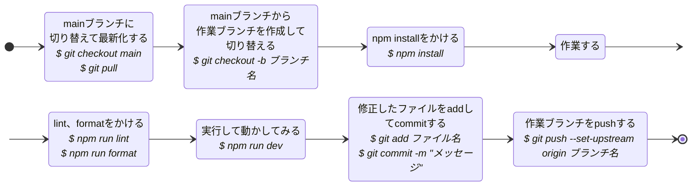

# ドキュメント

## 環境構築

**1. git clone**

```
git clone ~~~
```

**2. パッケージインストール**

clone したディレクトリへ移動

```
npm install
```

**3. 環境変数ファイルの作成**

```
cp .env.example .env
```

**4. 起動**

```
npm run dev
```

## 開発フロー

### 作業始めからpushまで



### Pull Requestを出すときの注意点

* 自分が作業したところのみが差分として検出されていることを確認する
* descriptionの頭に"close #○○"（○○はissueの番号）を入れる
  * これがあるとPull Requestをマージしたときそのissueが自動でcloseされて便利
* ReviewersにPMを指定する
* Assigneesに作業者自身とReviewersを指定する
* Pull Requestを出したらSlack上でReviewersにレビュー依頼を出す
  * メールも来るがSlackの方が気づきやすいので
* レビュー依頼のSlackにはPull Request URLも含める
  * 該当のPull Requestがすぐ分かる 

## 開発 Tips

### PullRequest

**1. プルリクエスト前の作業**

プルリクエストを上げる前に必ず、自分が作業を行なっているブランチで `git pull origin main` を行うこと。<br/>
もし、コンフリクトが発生したら、ローカル上で解決する、解決の仕方がわからない場合は、メンバーに相談すること。

**2. `git pull origin main` を行なった後の作業**

remote に変更があった場合は、 `git pull origin main` のコマンドを実行し、remote の変更を取り込む。<br/>
package に更新がないか、確認するため、 `npm install` コマンドを実行する。<br/>
`found 0 vulnerabilities` と表示されれば OK。

**3. プルリクエスト作成時**

- `PullRequestTemplate`を使ってください。
- 作ったブランチから main ブランチへマージするプルリクを作ってください。
- プルリクに issue 番号を紐付けてください。
- レビュアーに assign つけてください。（複数つけても OK）
- レビュー依頼の際は、PR 内にメンションコメント＆念の為 Slack にてレビュアーに声掛けお願いします。

**4. マージ**

- マージはスカッシュコミット（プルリク内のコミットを 1 つににまとめてコミット）でお願いします。
  - マージの際に`Marge Pull Request`ではなく`Squash and merge`を選んでマージしてください。

### Branch

### ブランチ命名規則（**プレフィックス**をつける）

- feature: 機能追加（基本これだけでよい）
- fix: コード修正
- bug: バグ修正

※ 該当項目がない場合は適宜追加

**＜例＞**

```
git checkout -b 'feature/todotop_layout'
git checkout -b 'fix/todotop_layout'
git checkout -b 'bug/todotop_layout'
```

### Commit

### コミットメッセージ

- 日本語もしくは英語で端的に

**＜例＞**

```
git commit -m 'Top画面 作成'
git commit -m 'create top layout'
```

## 使用技術

### フロントエンド
- [HTML](https://developer.mozilla.org/ja/docs/Web/HTML)
- [CSS](https://developer.mozilla.org/ja/docs/Web/CSS)
- [JavaScript](https://developer.mozilla.org/ja/docs/Web/JavaScript)
- [TypeScript](https://www.typescriptlang.org)
- [React.js](https://ja.react.dev)
- [Next.js](https://nextjs.org)

### バックエンド
- [Supabase](https://supabase.com)

### インフラ
- [Vercel](https://vercel.com)

### ツール
- [GitHub](https://github.co.jp)

## 言語 / パッケージ

- [Node.js](https://nodejs.org/ja)
- [npm](https://docs.npmjs.com/cli/v10/commands/npm-version)
